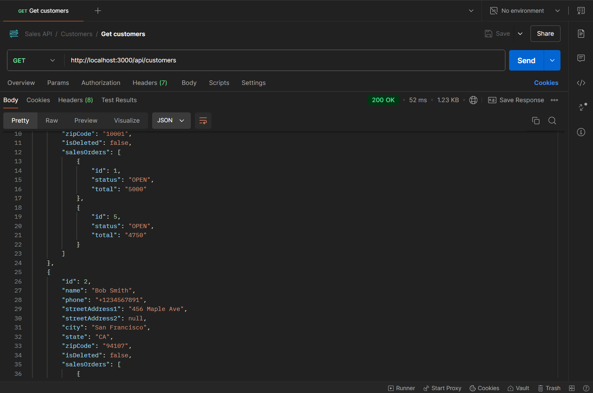
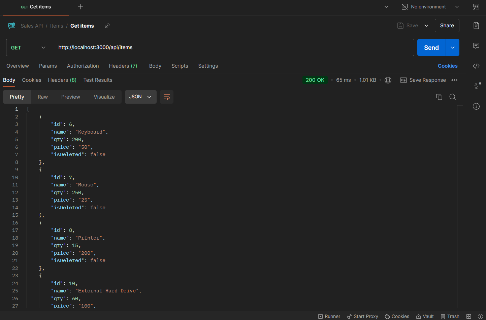
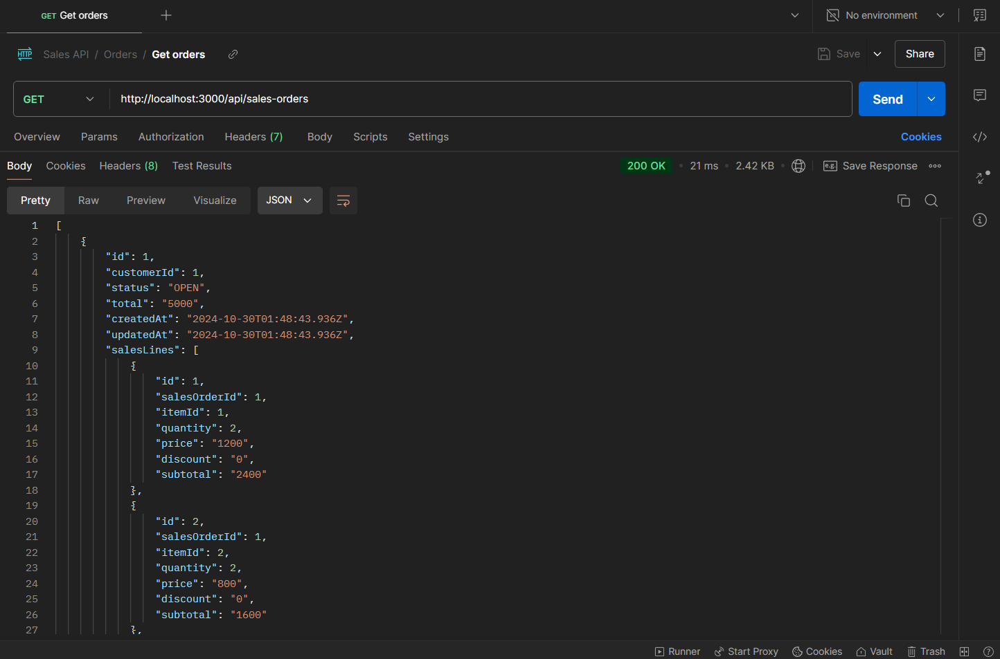
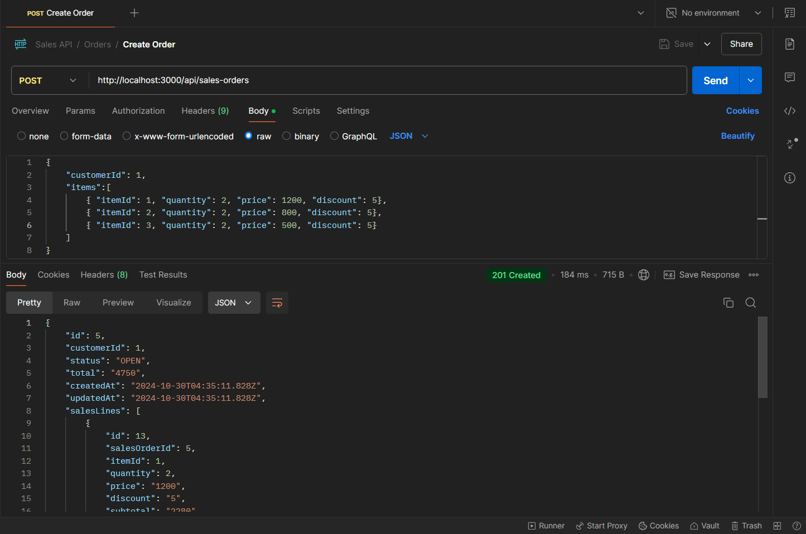

# Sales API 🚀

A backend application built with Node.js, NestJS, TypeScript, PostgreSQL and Prisma ORM designed to manage sales, items, and customers efficiently. The application is containerized using Docker for easy deployment and scalability.

## Table of Contents

- [Sales API 🚀](#sales-api-)
  - [Table of Contents](#table-of-contents)
  - [Features](#features)
  - [Technologies Used](#technologies-used)
  - [Installation](#installation)
  - [Usage](#usage)
  - [Running with Docker](#running-with-docker)
  - [Testing the API](#testing-the-api)
  - [API Endpoints](#api-endpoints)
    - [Customers](#customers)
    - [Items](#items)
    - [Sales Orders](#sales-orders)
  - [Screenshots](#screenshots)
  - [Contributing](#contributing)

## Features

- Sales, items, and customers management.
- Orders creation and status update.
- Comprehensive API documentation through Swagger for easy integration and understanding of endpoints.

## Technologies Used

- **TypeScript**: A typed superset of JavaScript that compiles to plain JavaScript.
- **NestJS**: A progressive Node.js framework for building efficient and scalable server-side applications.
- **Prisma ORM**: An ORM that simplifies database access and management.
- **PostgreSQL**: Relational database for storing data.
- **Docker**: Platform for developing, shipping, and running applications in containers.
- **Swagger**: API documentation and testing tool for RESTful services.

## Installation

1. Clone the repository:

   ```bash
   git clone https://github.com/Cristianjs93/sales-api
   ```

2. Navigate to the project directory:

   ```bash
   cd sales-api
   ```

3. Install the dependencies:

   ```bash
   npm install
   ```

## Usage

1. First than all, take a look at the `.env.example` file, then create a `.env` file in the root of the project and replace the placeholders with your own values.

2. Create a new PostgreSQL server and set the database connection details in the `.env` file.

3. Once you have created the database, run the migration command to create the necessary tables:

   ```bash
   npx prisma migrate dev
   ```

4. Now it's time to seed your database with some sample data (only necessary if it has not been executed automatically with the migration). Run the following command:

   ```bash
   npx prisma db seed
   ```

5. With all the stuff set up, you can start the application by running:

   ```bash
   npm start
   ```

6. The application will be running by default on port 3000:

   ```
   http://localhost:3000/api
   ```

## Running with Docker

1. Ensure you have Docker and Docker Compose installed on your machine.

2. Clone the repository if you haven't already:
   ```bash
   git clone https://github.com/Cristianjs93/sales-api.git
   cd sales-api
   ```
3. Make sure to create a `.env` file based on `.env.example` for your environment variables.

4. In this case you will not need to create the PostgreSQL server because Docker will do it for you based on your environment variables and the `docker-compose.yml` file.

5. Build and start the Docker containers:

   ```bash
   docker-compose up --build
   ```

6. Alternatively, you can run the command in detached mode (in the background) by adding the -d option:

   ```bash
   docker-compose up --build -d
   ```

7. The application will be running by default on port 3000:

   ```bash
   http://localhost:3000/api
   ```

8. You can seed your database with sample data. First run in a free the terminal:

   ```bash
   docker-compose exec api sh
   ```

   This command opens an interactive shell inside the running api container, allowing you to execute commands within that environment.

9. Now, inside the interactive shell run:

   ```bash
   npx prisma db seed
   ```

   This last two steps are only necessary if the seed command was not executed automatically when building the project.

## Testing the API

1. In both cases, whether you run the application directly with Node.js or with Docker, you will find the swagger documentation at:

   ```bash
   http://localhost:3000/api/docs
   ```

2. You can use Postman or any other API testing tool to test the API endpoints. Here is a link to the postman collection created for this purpose:
   [Postman collection](https://www.postman.com/cristianjs93/workspace/sales-api/collection/28278263-bb34653d-10ac-4839-b3a4-a3a9f335944b?action=share&creator=28278263)

3. Now you are free to test all the API endpoints.

## API Endpoints

### Customers

| Method | Endpoint               | Description                 |
| ------ | ---------------------- | --------------------------- |
| GET    | /customers             | Get all customers           |
| GET    | /customers/:id         | Get a single customer by Id |
| POST   | /customers             | Creates a new customer      |
| PUT    | /customers/:id         | Updates a customer          |
| DELETE | /customers/:id         | Soft Deletes a customer     |
| PATCH  | /customers/:id/restore | Restores a customer         |

### Items

| Method | Endpoint           | Description             |
| ------ | ------------------ | ----------------------- |
| GET    | /items             | Get all items           |
| GET    | /items/:id         | Get a single item by Id |
| POST   | /items             | Creates a new item      |
| PUT    | /items/:id         | Updates an item         |
| DELETE | /items/:id         | Soft Deletes an item    |
| PATCH  | /items/:id/restore | Restores an item        |

### Sales Orders

| Method | Endpoint                | Description                   |
| ------ | ----------------------- | ----------------------------- |
| GET    | /sales-orders           | Get all orders                |
| POST   | /sales-orders           | Creates a new order           |
| PATCH  | /sales-orders/:id/close | Update the status of an order |

## Screenshots


_*List of customers*_
<br/>


_*List of items*_
<br/>


_*List of orders*_
<br/>


_*Order creation*_

## Contributing

If you would like to contribute to this project, please fork the repository and submit a pull request. Any contributions, whether improvements or bug fixes, are welcome!
